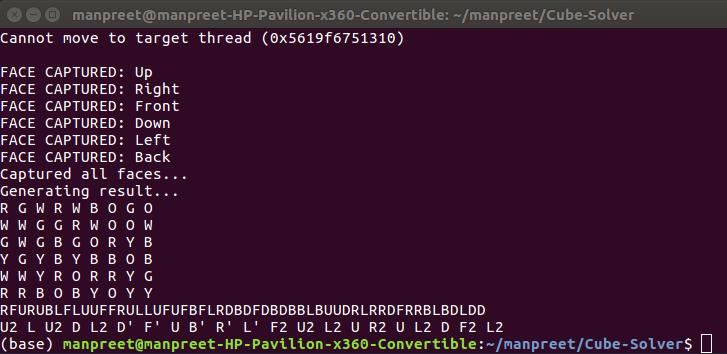

# Rubik's Cube Solver
Solve any **Rubik's Cube** orientation using **Computer Vision** under 20 moves with the help of the **Kociemba Method**.

## Table of Contents
1. [Usage](#usage)
2. [Procedure](#procedure)
3. [Scripts](#scripts)
4. [Future Development](#future-development)
5. [Note](#note)

## Usage
Clone the repository `git clone https://github.com/manpreet1130/Rubiks-Cube-Solver`  
Run `python setup.py` in order to configure the mask values as required  
Run `python solver.py` to run the main solver algorithm  

## Procedure
The project was divided into two main parts:
1. Identifying the colours of each facelet on each face
2. Passing these values to the kociemba library and receiving the algorithm solution

To identify each of the 6 colours, which are **WHITE**, **RED**, **GREEN**, **YELLOW**, **ORANGE** and **BLUE**, it was decided that the HSV image would be a better choice in comparison to RGB image as HSV is more robust to external light changes and hence a better choice for this application. A mask was created for each colour which included the lower and upper bounds for the hue, saturation and value respectively using which the colours were estimated for each face capture.
There are a total of 6 face captures and each capture is initiated with the '**A**' key. Following the capturing, an algorithm string is displayed on the console which when followed correctly, ends with a solved cube.

The naming convention for each face chosen by me is given below and may be changed if required:  

White (**W**) - Up (**U**)  
Green (**G**) - Front (**F**)  
Red (**R**) - Right (**R**)  
Yellow (**Y**) - Down (**D**)  
Orange (**O**) - Left (**L**)  
Blue (**B**) - Back (**B**)  

This is crucial to define as the Kociemba library takes in a string which concatenated the captured values in a particular order. This will become more clear with the help of an example.

As seen in the image, if we deduce what the string would look like for each face and the string readable by the kociemba library, it would be as follows:  
<pre>             Colour String      Kociemba Translated String  
White Face:   "RGWRWBOGO"            "RFURUBLFL"  
Red Face:     "WWGGRWOOW"            "UUFFRULLU"  
Green Face:   "GWGBGORYB"            "FUFBFLRDB"  
Yellow Face:  "YGYBYBBOB"            "DFDBDBBLB"  
Orange Face:  "WWYRORRYG"            "UUDRLRRDF"  
Blue Face:    "RRBOBYOYY"            "RRBLBDLDD"  
</pre>

The order in which we capture the faces matters as well. Order to be followed is:  
**Up -> Right -> Front -> Down -> Left -> Back**  
which in this case would correspond to  
**White -> Red -> Green -> Yellow -> Orange -> Blue**

<pre>
              U1 U2 U3
              U4 U5 U6
              U7 U8 U9
              
   L1 L2 L3   F1 F2 F3   R1 R2 R3   B1 B2 B3 
   L4 L5 L6   F4 F5 F6   R4 R5 R6   B4 B5 B6
   L7 L8 L9   F7 F8 F9   R7 R8 R9   B7 B8 B9
            
              D1 D2 D3
              D4 D5 D6
              D7 D8 D9
</pre> 

The resulting algorithm string for this particular orientation would be:  
**U2 L U2 D L2 D' F' U B' R' L' F2 U2 L2 U R2 U L2 D F2 L2**

The notation rules for this are as follows:
1) The letters U, D, L, R, F, and B correspond to the faces and rotation is done by 90 deg clockwise if no suffix.
2) The `'` at the end of a letter corresponds to rotating that face anticlockwise by 90 deg.
3) The `2` corresponds to rotating that face clockwise by 180 deg.

## Scripts
### setup.py
This script is there in case the masking values are not suited as per the colours of the cube. This script can be used to configure the masking values for each colour and update the same in the main script constants.

### solver.py
This is the main script to run in order to get the solution of the cube orientation.

## Future Development
As we now have the solving algorithm, the next step would be to create a setup capable of solving the cube by itself.

## Note
If the program terminates and doesn't provide the result, the colors on the cube weren't identified correctly. It must be taken into consideration that the facelets fall within the regions provided as any misalignment will not be detected as a correct colour and will lead to no algorithm being returned.

